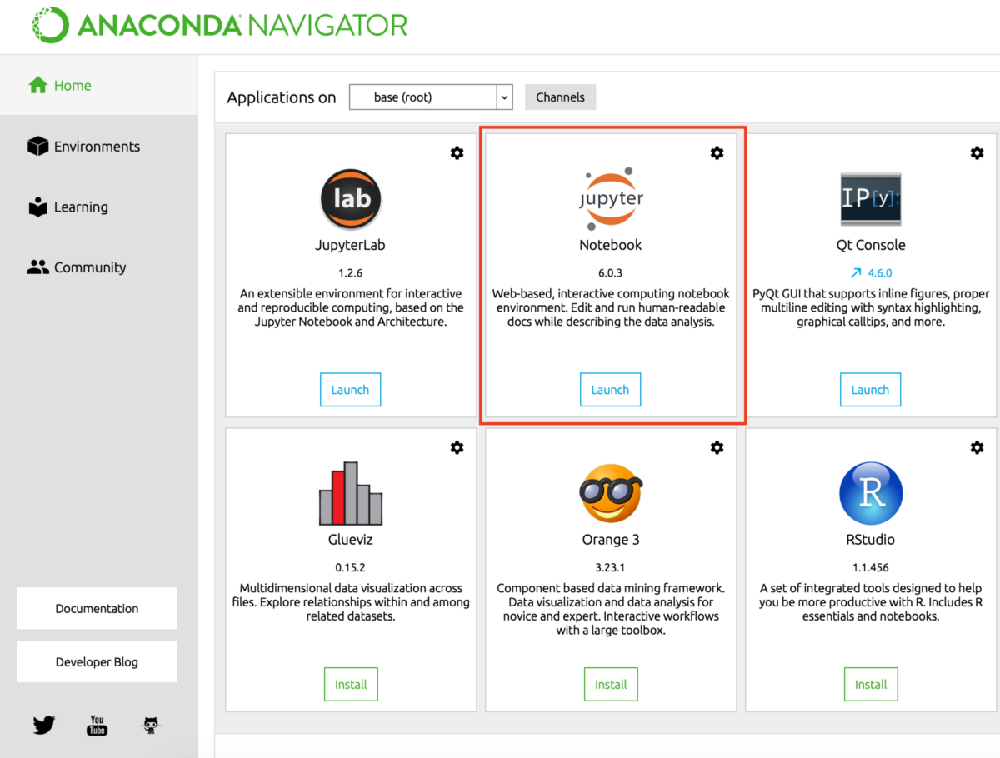
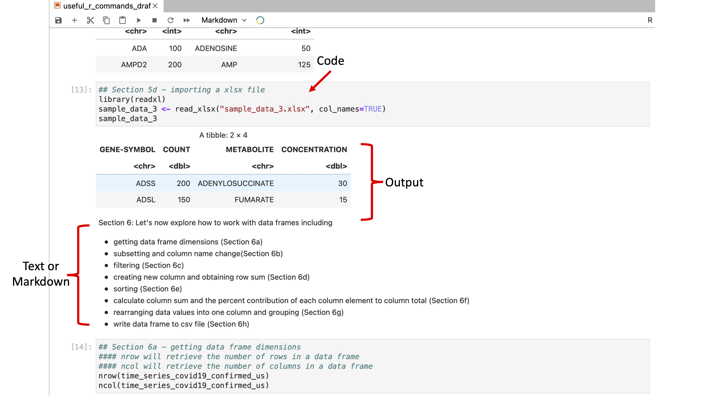
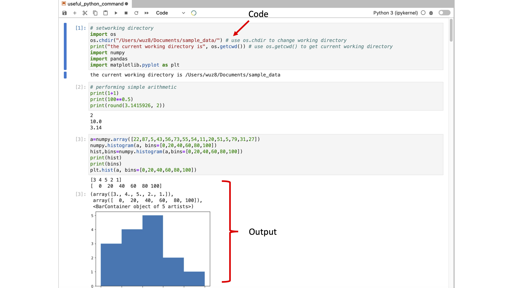

# Publishing your data analysis story with Jupyter Notebook
This GitHub page contains material for an introduction to Jupyter Notebook course taught by the Bioinformatics Training and Education Program (BTEP) at National Institutes of Health.

Objectives for this course included:
* Obtaining an understanding of what Jupyter Notebook does
* Getting to know ways to access and use Jupyter Notebook
* Becoming familiar with the Jupyter Notebook interface and working in Jupyter Notebook
* Getting to know methods for sharing Jupyter Notebook

## Jupyter Notebook is used for the following
* Documentation of data analysis
  - Text
  - Images
  - Equations
  - Links
  - Code
* Allows for sharing of data analyses
* Facilitate data analysis reproducibility

## Jupyter Note supports many languages
* Python
* R
* Julia
* C++
* Matlab
* Fortran

Figure 1: From https://www.dataquest.io/blog/jupyter-notebook-tutorial

## Ways to access Jupyter Notebook
* NIH HPC (Biowulf; https://hpc.nih.gov/apps/jupyter.html)
* Anaconda or mini conda distributions (allows Jupyter Notebook to be use locally)
  - https://www.anaconda.com/
  - https://docs.conda.io/en/latest/miniconda.html 
* Google Colab	
* Cloud computing services

## Start Jupyter Notebook with Anaconda Navigator - click on the Jupyter Notebook tab

* For Macs users, if going through mini conda 
  - From Finder, goto the Applications Folder
  - Select miniconda3 
  - Goto the bin folder
  - Click on jupyter-notebook and then copy and paste the URL that shows up in the terminal to a browser
* In Windows (I have a Windows 10 PC)
  - Goto Start
  - Then there should be a menu for Anaconda - open this
  - Click on Jupyter-Notebook

Figure 2: Starting Jupyter on Windows PC

## Jupyter Notebook starts in a web browser. Figure 3 and Figure 4 show examples of R and Python Jupyter Notebooks.

Figure 3: Example R Jupyter Notebook

Figure 4: Example Python Jupyter Notebook

