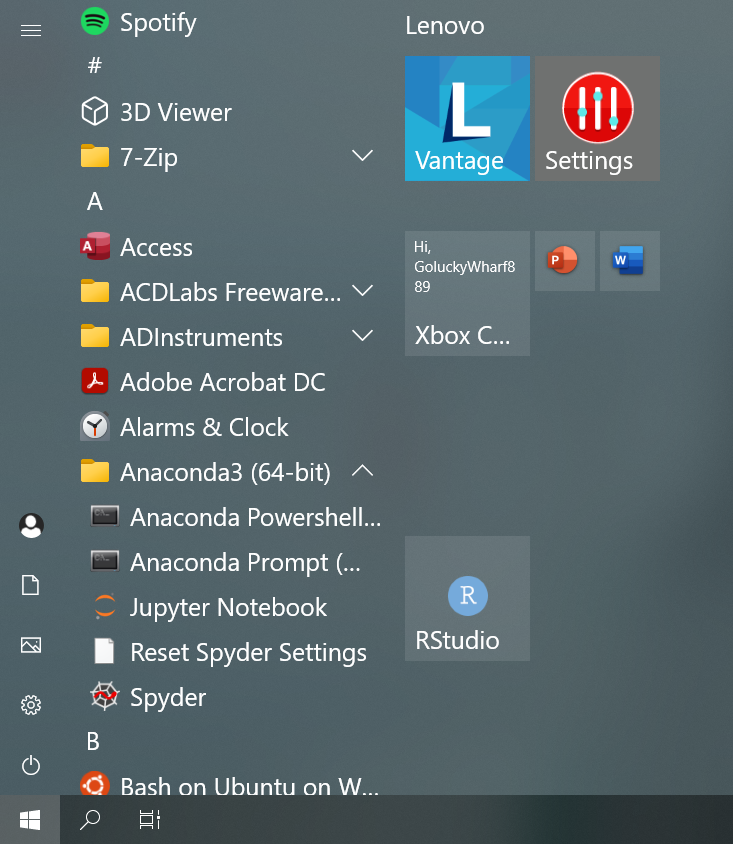

# Publishing your data analysis story with Jupyter Notebook
This GitHub page contains material for an introduction to Jupyter Notebook course taught by the Bioinformatics Training and Education Program (BTEP) at National Institutes of Health.

Objectives for this course included:
* Obtaining an understanding of what Jupyter Notebook does
* Getting to know ways to access and use Jupyter Notebook
* Becoming familiar with the Jupyter Notebook interface and working in Jupyter Notebook
* Getting to know methods for sharing Jupyter Notebook

## Jupyter Notebook is used for the following
* Documentation of data analysis
  - Text
  - Images
  - Equations
  - Links
  - Code
* Allows for sharing of data analyses
* Facilitate data analysis reproducibility. Figure 1 adapted from Rule et al (https://arxiv.org/pdf/1810.08055.pdf) highlights the work flow for reproducible analysis.

Figure 1: Reproducible analysis workflow

## Jupyter Note supports many languages
* Python
* R
* Julia
* C++
* Matlab
* Fortran
* Perl

Figure 2: From https://www.dataquest.io/blog/jupyter-notebook-tutorial

## Ways to access Jupyter Notebook
* NIH HPC (Biowulf; https://hpc.nih.gov/apps/jupyter.html)
* Anaconda or mini conda distributions (allows Jupyter Notebook to be use locally)
  - https://www.anaconda.com/
  - https://docs.conda.io/en/latest/miniconda.html 
* Google Colab

## Start Jupyter Notebook with Anaconda Navigator - click on the Jupyter Notebook tab

Figure 3: Starting Jupyter Notebook from Anaconda Navigator

* For Macs users, if going through mini conda - see Figure 4 and Figure 5
  - From Finder, goto the Applications Folder
  - Select miniconda3 
  - Goto the bin folder
  - Click on jupyter-notebook and then follow the instructions that show up in the command line terminal to open

Figure 4: Starting Jupyter on Mac - part 1

Figure 5: Starting Jupyter on Mac - part 2

  
Figure 6: Starting Jupyter on Mac - follow instructions on the bottom of the command line terminal that opens

* In Windows (I have a Windows 10 PC) - see Figure 7
  - Goto Start
  - Then there should be a menu for Anaconda - open this
  - Click on Jupyter-Notebook

Figure 7: Starting Jupyter on Windows PC

## Other ways to inferface with Jupyter Notebook
While we typically work with Jupyter Notebook via a web browser, there are other tools that we can use to interface with Jupyter Notebook.
* Visual Studio Code (https://code.visualstudio.com/docs/datascience/jupyter-notebooks)
* Spyder IDE (https://github.com/spyder-ide/spyder-notebook) - Spyder IDE is an integrated development environment for Python (like what R Studio is for R)

## Example of Jupyter Notebook written for single cell RNA seq analysis
[Example Jupyter Notebook for single cell RNA seq](https://nbviewer.org/github/theislab/single-cell-tutorial/blob/master/latest_notebook/Case-study_Mouse-intestinal-epithelium_1906.ipynb)

## Sharing Jupyter Notebook with collaborators and other researchers
* Github (static)
* Binder (others can actually run the codes; https://mybinder.org/)
* Other tools for sharing Jupyter Notebooks exist (see table 1 in https://www.ncbi.nlm.nih.gov/pmc/articles/PMC7359270/)

## Here we deploy our Jupyter Notebook, introduction_to_jupyter_2021129_draft1.ipynb to Binder as an interactive. There several files that we need to accomplish this. Click on each of the files to see the content.
* runtime.txt - tells Binder to install R
* requirements.txt - lists Python packages that Binder will need to install
* install.R - lists R packages that Binder will need to install
